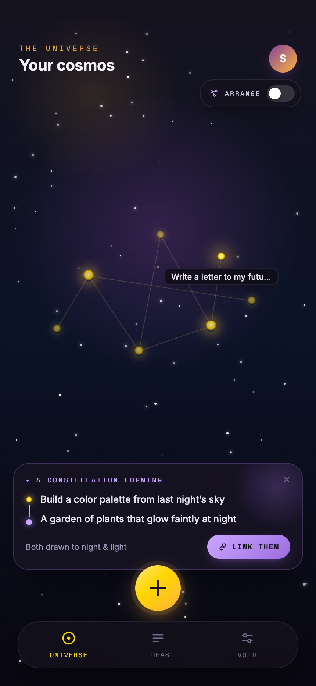
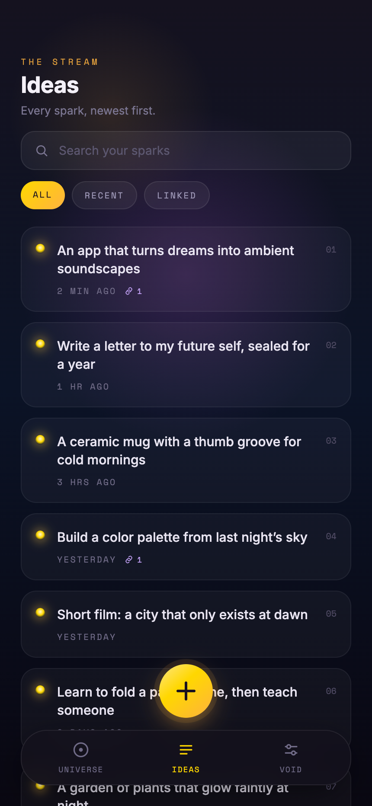
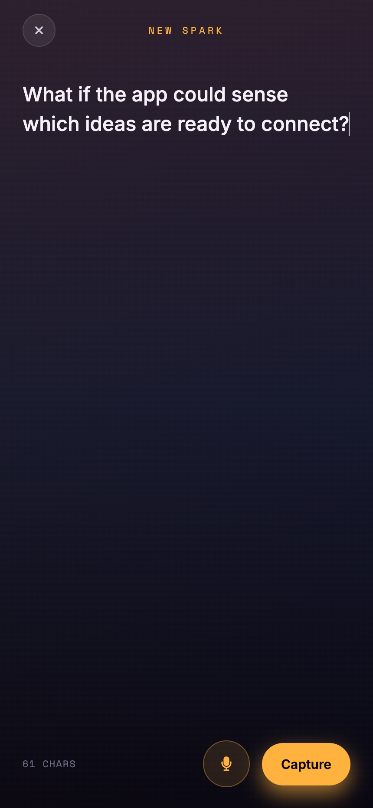
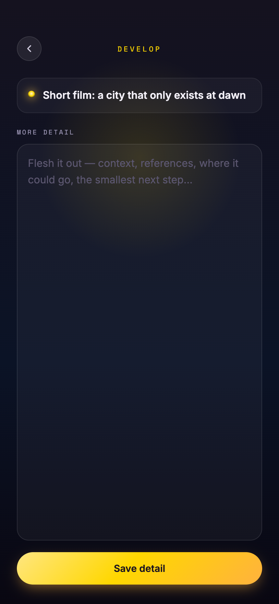
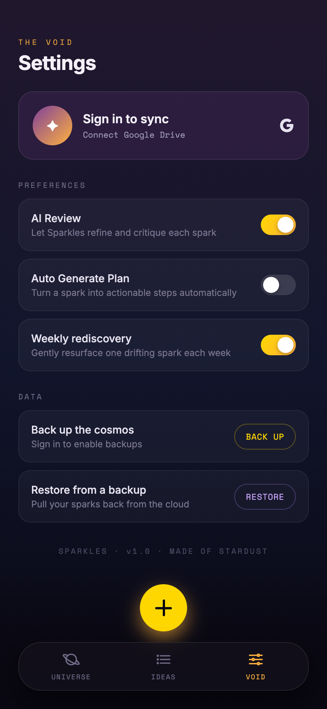

<div align="center">

# ✨ Sparkles

**A calm, local-first space where raw thoughts grow into constellations.**

Capture a spark in two seconds - typed or spoken - then watch your ideas
become a night sky you can explore, connect, and let AI cluster into themes.
Everything lives on your device. Backups go only to *your* Google Drive, encrypted.

<br>


</div>

```
        ·  ✦        ˚          ·                         The vault, felt as a sky:
   ✦        ·  ✧───────✦          ·                       ✦  an idea (a star)
        ·         │        ✦   ·                          ─  a link (a thread)
     ·      ✦─────┴──✦        ·        ✧                  ✧  a faded, older spark
   ˚            ·        ·  ✦      ˚         ·
```

> **Simple at first, deep over time.** Sparkles is a *thinking space*, not a
> productivity dashboard.

---

## 🌟 What's inside

| | Feature | Spec |
| --- | --- | --- |
| ⚡ | **Capture** — jot text offline, or record a voice note transcribed via a self-hosted Whisper service | [001](./docs/specs/001-capture-idea/spec.md) |
| ✍️ | **Develop** — reread, edit, and grow the thought | [002](./docs/specs/002-develop-idea/spec.md) |
| 🔗 | **Link** — on-device similarity suggests connections; confirm several at once | [003](./docs/specs/003-linking-ideas/spec.md) |
| 🌌 | **Constellation** — the home screen: ideas as stars, links as threads, scatter ↔ cluster | [004](./docs/specs/004-constellation-view/spec.md) |
| 🧠 | **AI Clusters** — group everything into themes (OpenAI or Claude), rate-limited & private | [005](./docs/specs/005-ai-clusters/spec.md) |
| 🔐 | **Backup & Restore** — client-side encrypted, straight to your own Google Drive | [006](./docs/specs/006-backup-restore/spec.md) |
| 📜 | **The Stream** — a searchable, filterable list of every spark | [007](./docs/specs/007-ideas-list/spec.md) |

---

## 📸 Screenshots

<div align="center">

| 🌌 Constellation | 📜 The Stream | ⚡ Capture | ✍️ Develop | ⚙️ Settings |
|:---:|:---:|:---:|:---:|:---:|
|  |  |  |  |  |

<sub>The home constellation · a searchable Stream of every spark · frictionless capture · developing one idea · encrypted backup & AI preferences</sub>

</div>

---

## 🚀 Quickstart — preview in under a minute

Sparkles is **local-first**, so the whole app runs with *zero backend and zero API keys*.
The AI and transcription services are optional add-ons (see [below](#-optional-backend-services)).

**Prerequisites:** [Node](https://nodejs.org) ≥ 20 · [pnpm](https://pnpm.io) ≥ 9
(`corepack enable`) · the [Expo Go](https://expo.dev/go) app, or an iOS Simulator / Android emulator.

```bash
# 1 — install the whole workspace
pnpm install

# 2 — launch the app
pnpm --filter @sparkles/mobile dev
```

Then pick your surface from the Expo dev server:

| Press | Opens on |
| --- | --- |
| `w` | your **browser** (react-native-web) — the fastest preview |
| `i` | **iOS Simulator** |
| `a` | **Android emulator** |
| 📱 scan QR | your **phone** via Expo Go |

That's it — capture an idea, tap the constellation, and watch it appear as a star. 🌠

---

## 🧩 Optional backend services

The core loop needs none of this. Add a service only when you want its feature.

<details>
<summary><b>🧠 AI clustering service</b> — powers AI Clusters (feature 005)</summary>

<br>

```bash
cd apps/ai-service
# create a .env with the keys below (it's git-ignored)
PORT=3001 pnpm dev        # ts-node, endpoint at http://localhost:3001
```

Point the app at it via the mobile `.env`: `EXPO_PUBLIC_AI_SERVICE_URL=http://localhost:3001`.

| Env var | Purpose |
| --- | --- |
| `PORT` | service port (default `3001`) |
| `AI_PROVIDER` | `openai` (default) or `claude` |
| `OPENAI_API_KEY` | required when provider is `openai` |
| `ANTHROPIC_API_KEY` | required when provider is `claude` |
| `CLAUDE_MODEL` | defaults to `claude-opus-4-8`; set `claude-haiku-4-5` for lower cost |
| `RATE_LIMIT_PER_DAY` | per-user request cap (default 10) |

Endpoints: `POST /cluster`, `POST /digest`, `GET /health`.

</details>

<details>
<summary><b>🎙️ Transcription service</b> — powers voice capture (feature 001)</summary>

<br>

Speech-to-text runs on your own hardware (no cloud API) via
[whisper.cpp](https://github.com/ggerganov/whisper.cpp), shipped as a
self-hosted Docker image with the binary + model baked in:

```bash
cd apps/transcription
docker build -t sparkles-transcription .
docker run -p 3002:3001 sparkles-transcription   # POST /transcribe, GET /health
```

Point the app at it: `EXPO_PUBLIC_TRANSCRIPTION_URL=http://localhost:3002`.

> ⚠️ Both services default to port **3001** — give them different host ports
> (e.g. AI on `3001`, transcription on `3002`) if you run them together.

</details>

<details>
<summary><b>🔐 Google Drive backup</b> — powers Backup & Restore (feature 006)</summary>

<br>

Requires Google OAuth client IDs and the encryption passphrase, set in the mobile
`.env` (`EXPO_PUBLIC_GOOGLE_CLIENT_ID_*`, `ENCRYPTION_PASSPHRASE`, and the Google
endpoint URLs). Backups are encrypted **on-device** and stored in your Drive's
hidden AppData folder — no Sparkles server ever sees your data or your key.

</details>

---

## 🔑 AI keys & model selection

The AI features (clustering & digests) run through a **swappable provider** — you
choose OpenAI or Anthropic Claude with a single env var. Keys live **only** in
`apps/ai-service/.env` (server-side); they are never bundled into the app, which
talks to the service over `EXPO_PUBLIC_AI_SERVICE_URL`.

| Provider | Turn it on | Key variable | Model |
| --- | --- | --- | --- |
| **OpenAI** (default) | `AI_PROVIDER=openai` | `OPENAI_API_KEY` | `gpt-4o-mini` *(fixed in code)* |
| **Anthropic Claude** | `AI_PROVIDER=claude` | `ANTHROPIC_API_KEY` | `CLAUDE_MODEL` *(default `claude-opus-4-8`)* |

**Switching providers** is just flipping `AI_PROVIDER` and supplying the matching
key — no code changes. Only Claude's model is configurable at runtime via
`CLAUDE_MODEL` (e.g. `claude-haiku-4-5` for lower cost / faster responses).

```bash
# apps/ai-service/.env — use OpenAI
AI_PROVIDER=openai
OPENAI_API_KEY=sk-...

# …or use Anthropic Claude
AI_PROVIDER=claude
ANTHROPIC_API_KEY=sk-ant-...
CLAUDE_MODEL=claude-opus-4-8       # optional; defaults to this
```

<details>
<summary><b>How to get an OpenAI API key</b></summary>

<br>

1. Sign in at **[platform.openai.com](https://platform.openai.com)**.
2. Add a payment method / credits under **Settings → Billing** (the API is pay-as-you-go).
3. Go to **[API keys](https://platform.openai.com/api-keys) → Create new secret key**.
4. Copy the key (it starts with `sk-…`, shown only once) into `OPENAI_API_KEY`.

</details>

<details>
<summary><b>How to get an Anthropic (Claude) API key</b></summary>

<br>

1. Sign in at **[console.anthropic.com](https://console.anthropic.com)**.
2. Add credits under **Billing** (also pay-as-you-go).
3. Go to **[API Keys](https://console.anthropic.com/settings/keys) → Create Key**.
4. Copy the key (it starts with `sk-ant-…`, shown only once) into `ANTHROPIC_API_KEY`.

</details>

> 💡 Keys are secrets — `.env` is git-ignored, so they stay out of the repo. Never
> commit a key or paste it into client code.

---

## 🗂️ Project structure

A [pnpm](https://pnpm.io) + [Turborepo](https://turbo.build) monorepo — thin apps
over a shared, typed core.

```
sparkles/
├── apps/
│   ├── mobile/          Expo + React Native app (iOS · Android · Web)
│   ├── web/             web target (served via the mobile app's --web)
│   ├── ai-service/      Express API for clustering & digests (OpenAI / Claude)
│   └── transcription/   whisper.cpp speech-to-text service (Docker)
├── packages/
│   ├── core/            domain models & types — the shared vocabulary
│   ├── db/              SQLite (native) / IndexedDB (web) repositories
│   ├── crypto/          vault encryption — PBKDF2 + AES-GCM
│   ├── ai/              provider abstraction (OpenAI + Anthropic) & prompts
│   └── ui/              StarNode, StarLink, PaperCard, theme…
└── docs/specs/          📐 the spec-driven-development source of truth
```

### Tech stack

| Layer | Choices |
| --- | --- |
| **App** | Expo SDK 54, React Native 0.81, React 19, Expo Router, TypeScript |
| **Data** | `expo-sqlite` on device · `idb` (IndexedDB) on web · one repository API over both |
| **Crypto** | `@noble/hashes` PBKDF2-SHA256 key derivation · `@noble/ciphers` AES-256-GCM · `expo-crypto` CSPRNG |
| **AI** | `openai` + `@anthropic-ai/sdk` behind a swappable provider factory |
| **Voice** | `expo-audio` capture → whisper.cpp transcription |
| **Tooling** | pnpm workspaces, Turborepo, Prettier |

---

## 🛠️ Workspace scripts

Run from the repo root:

| Command | What it does |
| --- | --- |
| `pnpm install` | install every workspace |
| `pnpm --filter @sparkles/mobile dev` | **start just the app** (recommended for preview) |
| `pnpm dev` | run all `dev` tasks via Turborepo (app + AI service together) |
| `pnpm build` | build every package/app |
| `pnpm lint` | lint across the workspace |
| `pnpm format` | Prettier over `**/*.{ts,tsx,md}` |

---

## 📐 Built spec-first

Sparkles is developed with **Spec-Driven Development**: every feature is a spec
before it's code. The spec is the source of truth; the implementation is a
projection of it.

```
constitution → spec (what/why) → plan (how) → tasks (ordered) → implement
```

Everything lives in **[`docs/specs/`](./docs/specs/)** — the
[project constitution](./docs/specs/constitution.md), one folder per feature
(`spec.md` · `plan.md` · `tasks.md`), and dependency-free helper scripts:

```bash
bash docs/specs/scripts/create-new-feature.sh "Timeline view of ideas"
bash docs/specs/scripts/check-prerequisites.sh --all
```

Start at the [`docs/specs` README](./docs/specs/README.md) for the full workflow.

---

## 🧭 Design principles

- **Local-first, always** — the device is the source of truth; the network is an
  enhancement, never a dependency for capture.
- **Your data is yours** — no idea content on any server we run; backups are
  encrypted client-side to your own Drive.
- **Calm by default** — whitespace, soft glow, gentle motion; AI is offered, never
  forced.
- **A small, shared core** — domain logic lives in `packages/`, apps stay thin,
  mobile and web share one contract.

<div align="center">
<br>
<sub>A personal thinking companion — capture fast, explore slow, connect meaningfully. ✦</sub>
</div>
