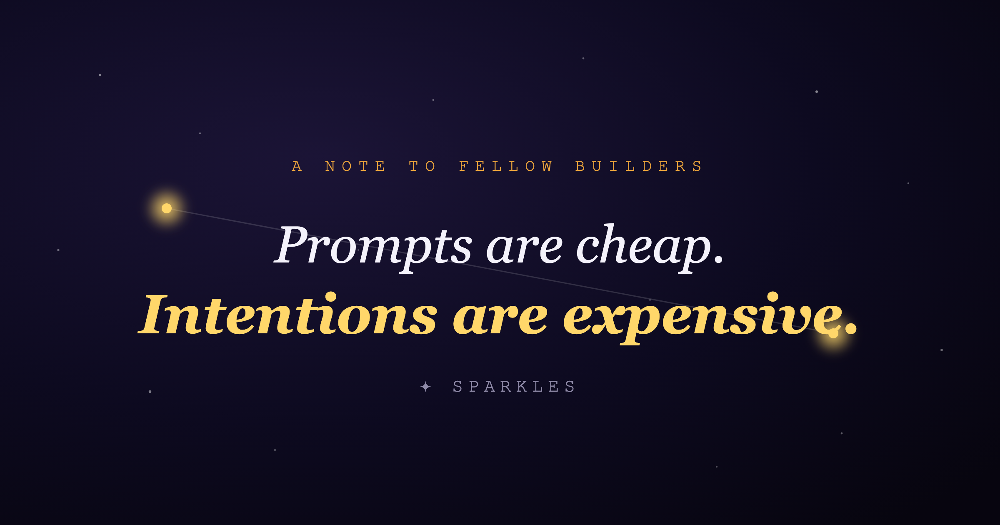

# Vibe Coding vs. Building With Intention

### How I turned a graveyard of half finished notes into a constellation, and why I refused to "vibe code" my way there.

---

I have a folder in Google Keep called "Ideas."

It has 400 something notes in it. A hook for a video I still haven't filmed. A plot twist for a story whose main character doesn't have a name yet. A line of dialogue so good I was certain I'd remember the scene it belonged to (reader, I did not). Three thumbnail concepts. A villain's motivation scribbled at 2 a.m. And, for reasons lost to history, a grocery list.

I'm a part time content creator and story writer, which is a polite way of saying I generate way more ideas than I will ever follow through on. And here's the thing nobody warns you about capturing everything: **capture was never my problem.**

I'm elite at capture. I can get a thought out of my head and into an app in about two seconds. What I'm catastrophically bad at is everything that happens *after*. Coming back to it. Remembering it exists at all. And the real gut punch, noticing that the idea I had in March was secretly the missing half of the idea I had in July.

My notes app wasn't a garden. It was a graveyard. Neat little rows of tombstones, each one a thought I swore I'd revisit, each one quietly gathering dust. Honestly, half my best ideas got Thanos snapped out of existence and I didn't even get a dramatic slow motion scene for it.

So I built the app I actually needed. It's called **Sparkles**, and instead of another bottomless list, it turns your ideas into a night sky.

---

## The problem isn't capture. It's connection.

When you dump thoughts into a linear notes app, two quiet little tragedies happen:

1. **They fall off the bottom.** Out of sight, out of mind. That note from three weeks ago may as well be in the Phantom Zone.
2. **They never touch each other.** A notes app treats every thought as a lonely island. But ideas aren't islands. They're a team. Their whole value is in the *lines between them*.

One idea on its own is Hawkeye showing up to an alien invasion with a bow and a bad attitude. A *connected* set of ideas is the whole Avengers actually assembling. The magic was never any single note. It was the crossover event.

A list can't show you that the joke you wrote on Tuesday belongs in the scene you sketched last month. A folder can't lean over and whisper, "psst, these five random notes are secretly one big series." That connective tissue, the exact part your brain is *worst* at holding onto, is the part every notes app cheerfully throws in the bin.

---

## Who this is really for

I built Sparkles for me. But the more I talked about it, the more I realized "people like me" is a much bigger club than I thought, and the membership card is just "too many tabs open, in your head and your browser."

**🌙 The scattered capturers.** You own three notes apps and trust exactly none of them. You screenshot things and never look at them again. You need capture to be frictionless *and* you need old sparks to resurface on their own, because you will not go looking for them. Be honest.

**✍️ Storytellers and novelists.** Writers have always known ideas are spatial. That's literally what the corkboard and index cards and red string is for. A character's fear lives in one note, a betrayal in another, a stray line of theme in a third. Sparkles is that corkboard, except the string is real and you can actually follow it. *That childhood wound connects to that third act betrayal,* and now you can see it instead of hoping you remember it.

**🎬 Scriptwriters.** A funny line. A cold open image. A theme you keep circling like a shark. In a flat list, that's just noise. As a constellation, you can link the joke straight to the scene it was born for and watch your script's skeleton appear before you've written a single page.

**🎥 Content creators.** You hoard hooks, video concepts, a spicy comment that sent you down a rabbit hole. The gold is never one idea. It's realizing eight of them are quietly the same series, and your entire content calendar has been hiding in plain sight this whole time.

**🧠 Deep thinkers and researchers.** You read a quote in April, half build an argument in June, and the lightning only strikes when the two finally collide. A tool that nudges "hey, these belong together" is doing the single most valuable intellectual move there is: synthesis.

**⚡ ADHD minds.** This one's personal. When a thought lands, you have *seconds* before it's gone forever, so capture has to be instant with zero "which folder, which tag, which planet" decisions. And because "out of sight" genuinely means "out of existence" for us, a **visual, spatial** memory beats a text list every single time. A sky you can wander is a lot kinder to a non linear brain than a scroll that keeps punishing you for forgetting.

If any of those made you nod a little too hard, congratulations, you're the target audience.

---

## Meet Sparkles

The whole idea fits in one sentence: **every thought is a star, every connection is a thread, and your mind becomes a sky you can actually walk through.**

**Capture is instant.** Type it, or just speak it and let it transcribe. No title, no folder, no tags, no decisions. Two seconds and you've lit a new star. It all works fully offline too, because a thought should never have to sit in a loading spinner while it dies.

**Then it becomes a constellation.** Your ideas float as glowing stars on the home screen. Tap one, connect it to another, and watch a thread light up between them. Older, lonelier sparks fade gently instead of vanishing. Present, but not yelling for attention.

**Want the boring linear view?** It's right there. A searchable "Stream" of every spark, filterable by what's linked or recent. Exploration and structure, sitting politely side by side.

**And when you're ready, AI helps you see the shape.** Ask it to cluster everything into themes, and the patterns you could never hold in your head just surface on their own. The AI is always *offered*, never forced. It's a quiet button in the corner, not a needy sidekick asking if you've considered its ideas.

One promise sits under all of it: **your ideas are yours.** Everything lives on your device. Backups are encrypted on your phone and go only to *your* Google Drive. No server I run ever lays eyes on a single thought.

---

## The part I care about most: I built this on purpose, not on vibes

Here's the fork in the road where I could have taken the easy path, and didn't.

There's a way of building software right now that people fondly call **"vibe coding."** You open an AI, describe what you want, accept whatever it hands back, and keep poking it by feel until something roughly works. For a weekend prototype it feels like a genuine superpower. I love it for that.

But vibe coding has a bill that always comes due later, and the bill says: **there is no source of truth.** Features drift. You forget *why* anything works the way it does. The AI happily bulldozes last week's decision because nobody ever wrote that decision down. You end up with an app that runs but doesn't *mean* anything, just a tall stack of "sure, whatever" suggestions in a trench coat.

For Sparkles, that felt like a betrayal of the whole point. This is an app about **intention**, about treating your own thoughts like they matter. I was not about to build it by accident.

So I used **Spec Driven Development (SDD)** instead.

### What that actually looks like

SDD flips the order everyone's used to. Instead of code first and meaning later, **the spec is the source of truth and the code is just a projection of it.** The flow goes:

> **constitution → spec → plan → tasks → implement**

- **A constitution.** Before a single feature, I wrote down the app's non negotiable principles. *Local first, always. Your data is yours. Calm by default. AI is offered, never forced.* Every later decision has to bow to these. Batman has exactly one rule. My app has six, and like Batman, the whole personality falls apart the second you break one.

- **A spec for every feature.** The *what* and the *why*, in plain English, with acceptance criteria. No code, no tech jargon. Just: what should this do, and how will we know it's actually done?

- **A plan.** The *how*. Data model, architecture, trade offs, every one of them traced back to a line in the spec.

- **Tasks.** The plan chopped into ordered, checkable steps.

- **Then, and only then, the actual code.**

Here's a real moment where this saved me. The spec for "Capture" had one ironclad line: *capturing an idea must never wait on the network.* That single sentence, born straight from the "local first" article in the constitution, forced an entire architecture decision. A local database as the source of truth, with sync as an optional layer bolted on top. If I'd been vibe coding, I would have wired capture to a cloud API on autopilot and quietly gutted the soul of the app. The spec caught it before I wrote one line of code.

### But wait, didn't you use AI anyway?

Oh, constantly. I built this with a *ton* of AI help. The difference is entirely in *what the AI was building from.*

Vibe coding hands the AI a vague wish and a prayer. SDD hands it a **blueprint**. Give the AI a constitution and a spec to work against, and it stops being a slot machine you keep yanking and becomes an actual collaborator that knows exactly what you're making. Better still, one you can *check*, because "done" was defined before the work ever started.

You know Hulk's line, "that's my secret, Cap, I'm always angry"? That's my secret, Cap. I always write the spec first. The AI didn't replace my intention. The spec **protected** it.

### Assembling the team (the actual build)

None of this got built in one heroic sitting, and definitely not with a single tool. The origin story went through phases, like any self respecting hero.

It started in **Google Stitch**, where I sketched the first mockups and finally got the shape of the screens out of my head. From there I jumped into **Google's Antigravity**, riding Gemini and a very healthy pile of free credits, to rough out the early prototypes. (One does not simply say no to free credits.)

Then I tried **Claude Design**, and *that* was the real game changer. It was the first moment the app stopped looking like a wireframe and started looking like something with a soul. Once the design clicked, I handed it to **Claude Code**, wired up through **MCP** and running on **Claude Opus 4.8**, to turn those screens into a real, working app. That was the pairing that did the heavy lifting: the design in one hand, the implementation in the other, both aimed at the same spec. And for one short, glorious window I got to build on **Fable**, which, and I truly do not say this lightly, was absolutely awesome.

If vibe coding is a slot machine, this felt more like the good kind of team up, where every member actually had a role and knew the plan.

One more deliberate call worth naming: the app runs on **React Native with Expo**, and that was no accident either. I'm one part time human, not a studio. Expo let me write the app once and ship it to iPhone, Android, and the web from a single codebase, which is basically the only way a solo builder covers every platform without losing their mind. It also fits a **local first** app like a glove, since an on device SQLite database sits right there in the stack, so "your ideas never leave your phone" was the default instead of a battle. And the feedback loop is almost unfair: save a file, watch it update live on a real phone in seconds. When you're fussing over the exact glow of a star or how slowly a thread fades in, that instant loop is the whole ballgame.

### Vibe coding is dead.

Let me just say the quiet part at full volume: **vibe coding, as a way to build anything you actually care about, is dead.**

It had a great run. For about a year, "just prompt it and see what happens" felt like the future had arrived early. But we've all seen where that road dead ends now. A repo nobody understands. Bugs that respawn the instant you kill them. An AI confidently undoing a decision from last Tuesday because there was never a written decision to respect in the first place. The demos were dazzling. The maintenance was a horror movie. What looked like speed was just **debt wearing a really nice UI.**

The pit is seductive because hour one feels *amazing*. You get a working screen in minutes and think, "why did anyone ever bother planning?" Then hour twenty rolls in. Nothing has a reason. Every tiny change threatens to break three things you forgot existed. You're not building anymore, you're just negotiating with a slot machine and hoping it likes you.

Here's the mindset shift that dragged me out of it:

Writing a spec feels slower for roughly a day. Then it pays you back for the entire life of the project, because every prompt after that is *aimed*. The AI is still doing ninety percent of the typing. It's just no longer allowed to *guess what you meant*. That's the whole game. The people still shipping a year from now won't be the ones with the cleverest prompts. They'll be the ones who bothered to write down what they were trying to build.

So if you take one single thing from this whole article: **do not fall into the pit.** Vibe your throwaway prototypes to your heart's content, that's exactly what they're for. But the moment something starts to actually matter to you, stop vibing and start specifying. Intention is the one thing the machine cannot generate for you.

---

## What I'd tell you if you're standing where I was

If you've got your own graveyard of notes, your own Keep folder with 400 little tombstones, I promise I get it. The problem was never a shortage of ideas. You have too many, scattered too wide, with no way to see how any of them connect.

Maybe the fix isn't another folder. Maybe it's a sky.

And if you're building something of your own, it's worth asking, honestly, whether you're building *by accident* or *on purpose*. Vibe your prototypes, sure. But the moment a project starts to *mean* something to you, write down what it means first. Let the intention lead. The code will follow.

I built a night sky for my ideas. Turns out I needed one for how I build things too.

---

## Try it, and go read the specs yourself

Sparkles is **open source.** The whole thing lives right here:

### 👉 [github.com/iamntg/Sparkles](https://github.com/iamntg/Sparkles)

Clone it, get it running locally in about a minute (the README genuinely walks you through it), and go turn a few of your own scattered thoughts into stars. And if you're even a little curious what "spec driven" looks like in the wild, open up [`docs/specs/`](https://github.com/iamntg/Sparkles/tree/main/docs/specs). Every feature's constitution, spec, plan, and tasks are sitting there in the open. That folder *is* the app's intention, written down where you can read it.

If you give it a spin, I genuinely want to hear from you:

- ⭐ **Star the repo** if the idea speaks to you. It helps other scattered minds find their way here.
- 🐛 **Open an issue** with what broke, what confused you, or what you wish it did.
- 🌌 **Tell me how your ideas connected.** The surprising links are the entire point.

---

*Sparkles is a local first, offline friendly thinking space, built with Expo, React Native, and an almost unreasonable number of deliberately written specs. If "turn my scattered thoughts into a constellation" spoke to you, I'd love to hear how your ideas connect.*

*✦ Thanks for reading. If this resonated, a clap or a comment helps more people with graveyards of notes find it, and hey, go [give Sparkles a try](https://github.com/iamntg/Sparkles).*

<!-- ───────────────────────────────────────────────────────────────
PUBLISHING NOTES (not part of the article body, delete before/after paste)

Medium tags (max 5, lead with the first). Recommended set:
  1. Vibe Coding
  2. AI
  3. Building In Public
  4. Productivity
  5. ADHD

Swap-in bench:
  - More builder/AI angle:  Spec Driven Development, React Native, Software Development, Artificial Intelligence
  - More creator/user angle: Note Taking, Second Brain, Writing, Indie Hacking

Cross-post hashtags (X / LinkedIn, pick 3-5 per post):
  #VibeCoding #BuildInPublic #AI #IndieHackers #ReactNative #ADHD #SecondBrain #SpecDrivenDevelopment
─────────────────────────────────────────────────────────────── -->
